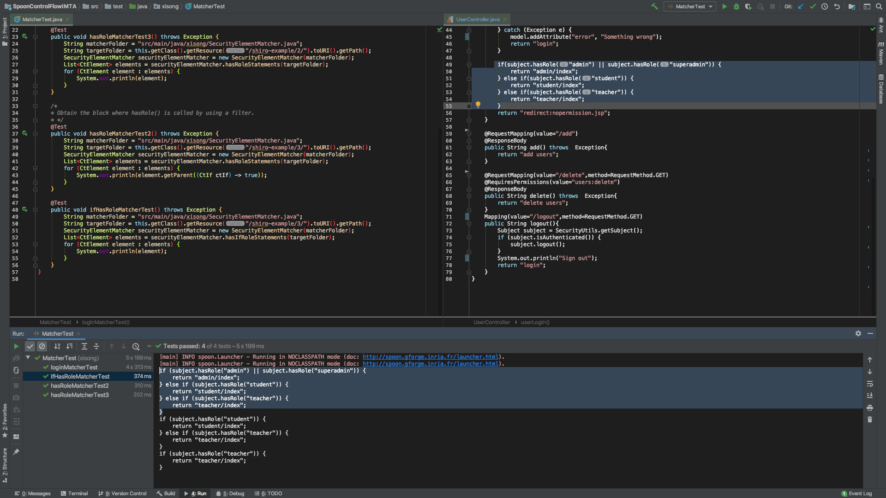

# Read me
Work progress and things to do for every week.

## 6th Week
Done:
1. Get a test exmaple of checkRole in try-catch structure and verify that the method

TODO:
1. Export this project in Eclipse
2. Use Eclipse Modeling Framework to create a data structure instead of a map structure for the store of result

## 5th Week
Simple explication of class [SecurityElementMatcher](src/main/java/xisong/SecurityElementMatcher.java):
1. Key function is `roleStatementMap()` who aims to get a role-statements map.
2. Following steps are taken for the object:
    1. Use *matcher* in spoon to get all eligible code elements
    2. Use *filter* in spoon to get specific strucre, like if or try-catch
    3. Use regular expression to get roles
    4. Put statements in a list and then make this list bound with corresponding role in a map

DONE:
1. `subject.checkRole()` in try-catch structure, implemented [here in method `getTryStatements`](src/main/java/xisong/SecurityElementMatcher.java)
    * One problem : no example found
2. `subject.checkRole()` in a function who throws an exception if something goes wrong in the method `methodStatementMap(String target)` in class [`SecurityElementMatcher`](src/main/java/xisong/SecurityElementMatcher.java)
    * Able to get all methods that contain a `subject.checkRole()`
    * Working on extraction of all statemetns after the call of `subject.checkRole()`
3. `subject.isPermitted()` in if structure

TODO:
1. Test need to be done for `subject.checkRole()` in a try-catch structure. However, no example found until now.
2. Get more test exmaples in Github.
    

## 4th Week
1. Obtain all statements corresponding to each role.
2. Add 3 new complete application as test cases.

## 3rd Week
1. Obtain the block where a specific function is called. Check [here](src/test/java/xisong/MatcherTest.java).
For example:

## 2nd Week
1. Shiro examples from :s
    1. https://github.com/jjoe64/shiroexample
    2. little demo written by myself
2. [SecurityElementMatcher](src/main/java/xisong/SecurityElementMatcher.java) could find specified security element in given codes.
3. Result CFG could be stored in given directory in [GenerateCfg](src/main/java/xisong/GenerateCfg.java).

## 1st Week
1. Examples of different statements and corresponding control flow graphs 
are in the [folder here](src/test/resources/control-flow).
2. Example of the filter to search particular methods by given name is in
 [here](src/test/java/xisong/QueryParticularFunction.java).
3. For a Web application, a graph could be generated but **need to be refined**.
Because there are some strange begin blocks. 
